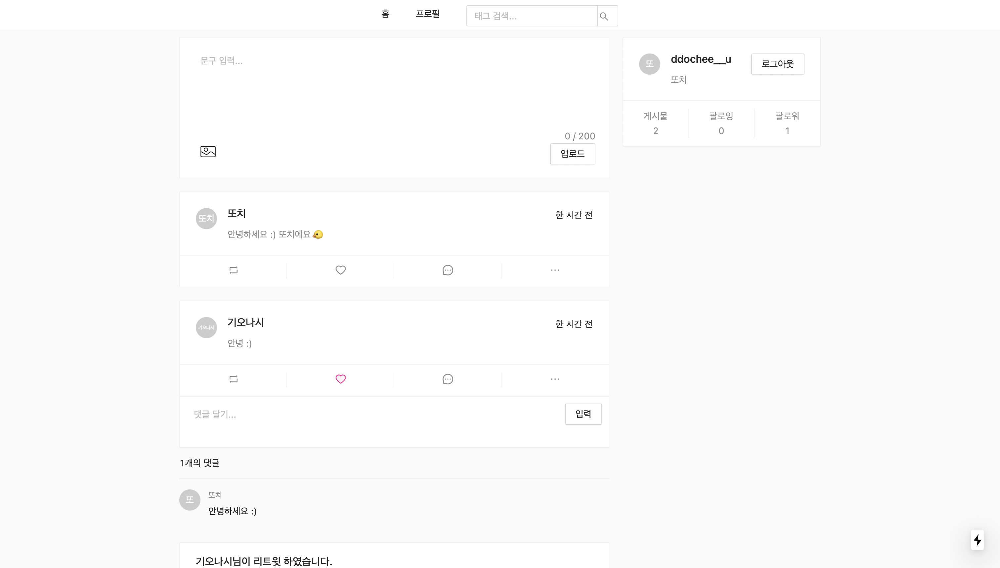
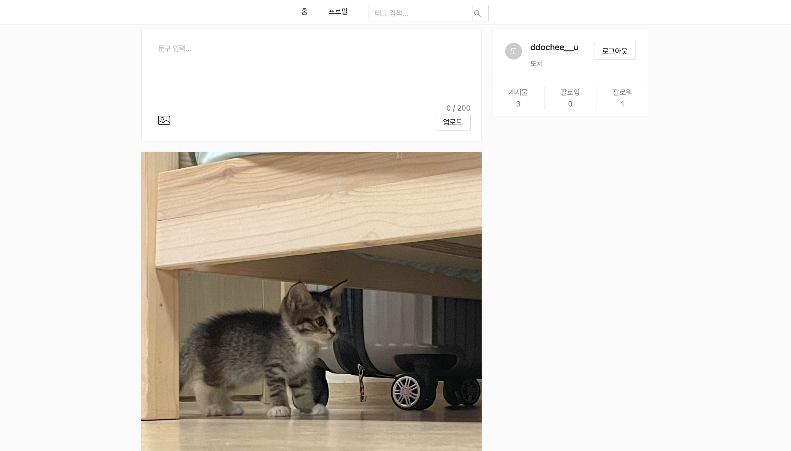
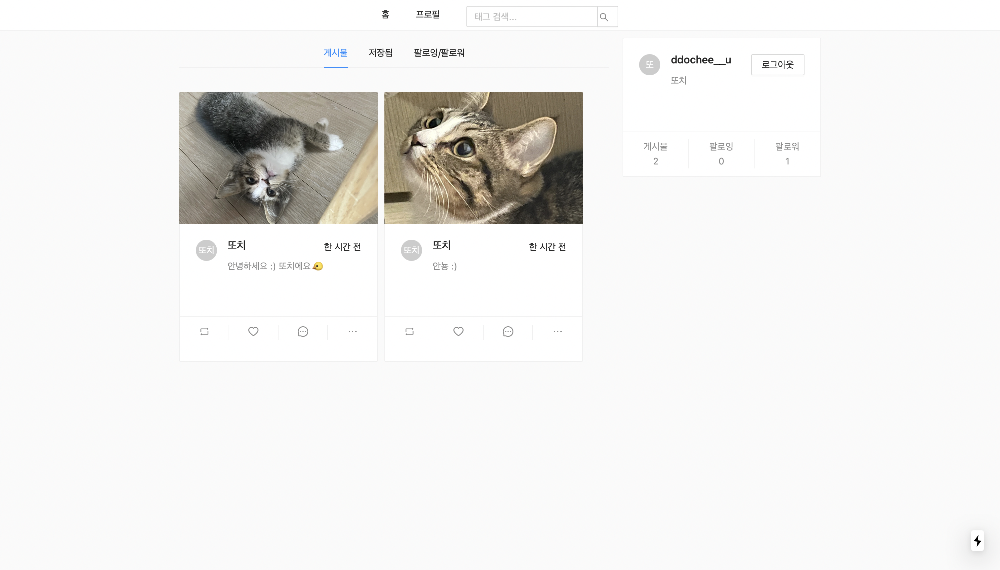

# SNS Service

## About
[Twitter](https://twitter.com/?lang=ko)와 [Instagram](https://www.instagram.com/)을 clone coding 한 프로젝트 입니다.

## Preview



## Build

### Preinstall
#### 1. Install Node.js
* <https://nodejs.org/ko/download/>

#### 2. Install yarn
* <https://yarnpkg.com/en/docs/install>

#### 3. Install Mysql
* https://www.mysql.com/

#### 4. Install & Start Node Modules
* Front

```bash
cd ./front
yarn

## Start Dev Server
yarn dev
```

* Back
```bash
cd ./back
yarn

## Start Dev Server
yarn dev
```

## Environments
`back` 폴더에 `.env` file 생성
 * `COOKIE_SECRET` : 쿠키 정보 설정
 * `DB_PASSWORD` : `MySql` 데이터베이스 비밀번호 설정
 * `SERVER_IP` : local로 실행할 경우 백엔드 ServerIP 설정 